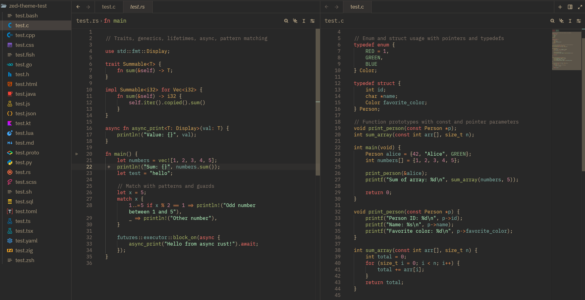

# Zed Gruvbox Material Neovim
---

This is a port from [f4z3r's neovim gruvbox material](https://github.com/f4z3r/gruvbox-material.nvim/tree/master) pallete for the [Zed editor](https://zed.dev/). 

I am a bit picky with my gruvbox themes which led me to porting it over from my current neovim config due to the existing ones for zed not satisfying my tastes.

I really liked the pallete from that theme and decided to port it over to zed. The syntax mappings for some types in zed are limited so they are not the exact same however, but I think it's similar enough. For example the `#include` token in c is default labeled explicitly purple in neovim gruvbox material, but in this extension, it is mapped to the `keyword` type of token which I set to red.

Feel free to let me know if there are any issues with the theme under specific use cases.

## Installation
You can install this colorscheme via the zed extensions tab.
Clone the repository and select "Install Dev Extension"
<!--Press Ctrl+Shift+x in Zed and type `Gruvbox Material Neovim`-->
